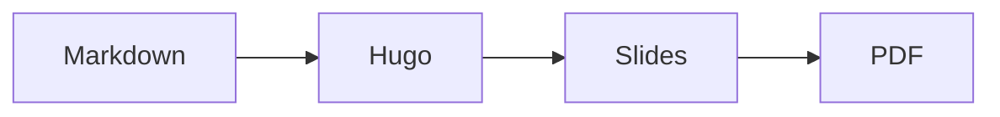



# Hugo PowerSlides

## A Markdown slide system for Hugo

Lightweight, static, and easy to theme.


Briefly introduce Hugo PowerSlides and explain that the presentation is written entirely in Markdown.


---



# Features


- Keyboard, clicker, and swipe navigation
- Step-by-step reveals
- Presenter mode with timer, next slide, and notes
- Ready-made layouts and thirteen transitions
- Color themes driven by CSS custom properties
- PDF export from the browser



Each item appears on the next key press. In this window, upcoming items are shown faded.


---



# Navigation

| Keys                                      | Action                     |
| ----------------------------------------- | -------------------------- |
| <kbd>→</kbd> <kbd>Space</kbd> <kbd>Page Down</kbd> | Next step or slide  |
| <kbd>←</kbd> <kbd>Page Up</kbd>           | Previous step or slide     |
| <kbd>Home</kbd> <kbd>End</kbd>            | First or last slide        |
| <kbd>1</kbd> <kbd>2</kbd> … <kbd>Enter</kbd> | Go to slide number      |
| <kbd>O</kbd> or <kbd>Esc</kbd>            | Overview of all slides     |
| <kbd>F</kbd>                              | Fullscreen                 |
| <kbd>P</kbd>                              | Presenter window           |

On touch screens, swipe left or right.

---



# Step-by-step reveals


- Wrap content in `fragments`
- Each item is one step
- Styles: `up`, `fade`, `zoom`, `highlight`


```markdown

- Each item is one step

```


Going back shows every step of the previous slide.



Any element with the `fragment` class also becomes a step, for example `<p class="fragment">`.


---



# Layouts

Pick a layout per slide with the `layout` option.


Section slides are numbered automatically, in order of appearance.


---



# Available layouts

| Layout        | Use it for                          | Needs `image` |
| ------------- | ----------------------------------- | :-----------: |
| `default`     | Regular content                     |       —       |
| `title`       | Opening or closing slide            |       —       |
| `section`     | Numbered part divider               |       —       |
| `center`      | Statements and quotes               |       —       |
| `hero`        | Full-bleed image with a big message |      Yes      |
| `image-left`  | Image on the left, text on the right |     Yes      |
| `image-right` | Text on the left, image on the right |     Yes      |

---



# Ship it.

The `hero` layout places an image behind the text, with a dark scrim that keeps it readable.


Without alt text, the hero image is treated as decorative.


---



# Image on the left

Text sits on the right and stays vertically centered.

- The image covers its half of the slide.
- On small screens, it stacks above the text.

---



# Image on the right

Same layout, mirrored.

Use `alt` to describe meaningful images.

---



# Backgrounds

Any slide can have a background image or color:

```markdown


```

The image is tinted with the theme background, so text stays readable.

---



> Simplicity is prerequisite for reliability.

— Edsger W. Dijkstra

---



# Columns



### Write

Plain Markdown, one file.


### Build

`hugo` renders static HTML.


### Present

Any browser, no dependency.



```markdown


### Write
...


```

---



# Markdown content

Code, tables, quotes, and callouts, styled out of the box.

---



# Code

Colors follow the slide theme. Highlight lines with `hl_lines`:

```js {hl_lines=[2]}
function goNext() {
  render(currentIndex + 1);
}
```

This requires classes instead of inline colors in `hugo.toml`:

```toml
[markup.highlight]
  noClasses = false
```

---



# Tables

Standard Markdown tables, with column alignment:

| Transition | Style   | Duration |
| :--------- | :------ | -------: |
| `fade`     | Subtle  |   450 ms |
| `push`     | Classic |   450 ms |
| `iris`     | Retro   |   700 ms |
| `spin`     | Kitsch  |  1000 ms |

---



# Text elements

> Blockquotes stand out with an accent bar.

Press <kbd>F</kbd> for fullscreen, <kbd>P</kbd> for presenter mode, and <mark>highlight</mark> key words.

- [x] Task lists
- [ ] Nested lists
  - with smaller items

---



# Callouts


A neutral remark.



Each type has its own icon and title, not just a color.



Something to be careful about.


---



# Math

KaTeX renders formulas, inline like \(e^{i\pi} + 1 = 0\) or as blocks:

$$
\int_0^1 x^2 \, dx = \frac{1}{3}
$$

It loads only when a page contains math, from a pinned version checked with Subresource Integrity.


Math needs the Goldmark passthrough extension in `hugo.toml`, so that Markdown leaves the LaTeX untouched.


---



# Diagrams



A `mermaid` code block becomes a diagram in the slide's theme colors.

---



# Video and embeds



```markdown


```


Autoplay videos start muted when the slide appears and pause when it is left. Embeds load only when their slide is current or next.


---



# Figure shortcode



```markdown

```

---



# Transitions

From subtle to shamelessly kitsch.

---



# Choosing a transition

Set it per slide, per page (`transition` in front matter), or site-wide:

```markdown

```



### Subtle

`fade` `slide` `up` `zoom` `blur` `none`


### Classic

`push` `flip` `wipe` `iris`


### Kitsch

`spin` `bounce` `swing` `tv`




The next slides demonstrate each transition. They all fall back to a short fade when the system asks for reduced motion.


---



# `slide`

Slides in horizontally, following the navigation direction.

---



# `up`

Moves upward into view.

---



# `zoom`

Zooms in and out.

---



# `blur`

Comes into focus.

---



# `push`

Pushes the previous slide out of the way.

---



# `flip`

Turns like a card.

---



# `wipe`

Reveals itself from the side.

---



# `iris`

Opens like an old movie ending in reverse.

---



# `spin`

Breaking news! The newspaper spin is back.

---



# `bounce`

Drops in with a bounce.

---



# `swing`

Swings down on its hinges.

---



# `tv`

Turns on like a cathode-ray tube.

---



# Themes and colors

Five built-in palettes, fully overridable.

---



# Built-in themes

`dark` (default), `light`, `solarized`, `synthwave`, and `terminal`.

```toml
[params.powerslides]
  theme = "light"
```

Or per page in front matter (`theme: light`), or per slide:

```markdown

```

---



# `light`

A clean palette for bright rooms.

| Token     | Role               |
| --------- | ------------------ |
| `primary` | Links and accents  |
| `muted`   | Secondary text     |

---



# `solarized`

Warm and easy on the eyes.


Every color remains readable: text contrast is at least 4.5:1.


---



# `synthwave`

## Neon glow included

---



# `terminal`

```sh
$ hugo server
Web Server is available at http://localhost:1313/
```

---



# Custom colors

Override any token in `hugo.toml` (or `colors` in front matter):

```toml
[params.powerslides.colors]
  primary = "#34d399"
  on-primary = "#022c22"
  background = "#0f172a"
```

Tokens: `background`, `surface`, `border`, `text`, `muted`, `primary`, `on-primary`, `accent`, `warning`, `code-background`, `code-text`.

For fonts or anything else, add stylesheets with `customCSS`.

---



# Entrance animations

These play automatically when the slide appears:

<ul>
  <li class="anim-fade">Fade animation</li>
  <li class="anim-up">Move upward</li>
  <li class="anim-zoom">Zoom animation</li>
</ul>

```html
<li class="anim-up">Move upward</li>
```


Inline HTML requires `markup.goldmark.renderer.unsafe = true` in the site configuration.


---



# Speaker notes

Speaker notes are written with the `notes` shortcode:

```markdown

These notes are only visible to the presenter.

```

They remain synchronized with the current slide.


Demonstrate how speaker notes can be used during a presentation without appearing on the slides.


---



# Presenter mode

Press <kbd>P</kbd> to open the presenter window. It stays in sync with the audience window and shows:

- the current slide, with upcoming steps faded;
- the next slide;
- speaker notes;
- elapsed time, which can be paused or reset, and the clock.

---



# Export to PDF

Print the presentation from the browser (<kbd>Ctrl</kbd> <kbd>P</kbd>) and choose **Save as PDF**:

- one page per slide, at the slide size;
- every step shown;
- controls and notes hidden.


Enable **Background graphics** in the print dialog if your browser asks. Chromium-based browsers give the best results.


---



# Thank you!

## Questions?


Conclude the presentation and invite questions.

